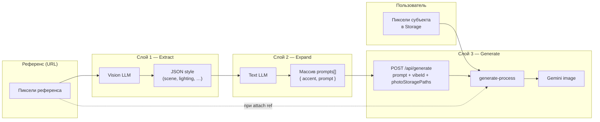
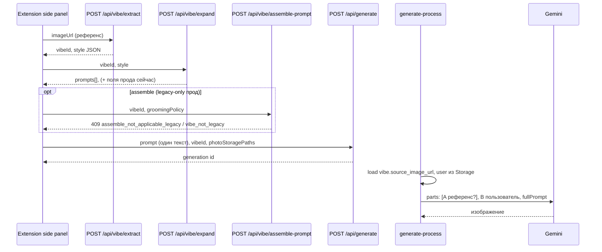
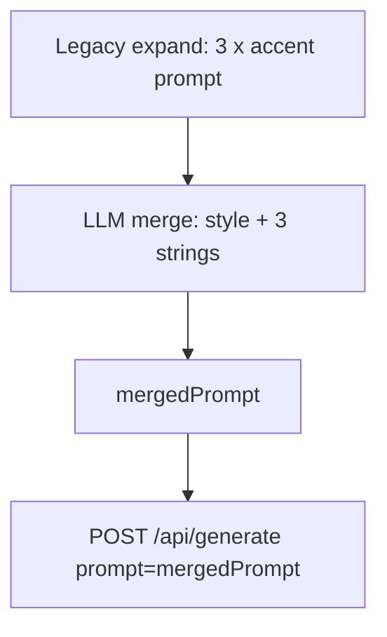

# Steal This Vibe: цепочка промптов из `2c23ce94` → текущий прод (одна генерация)

> **Версия документа:** 2026-03-23 (extract **`scene`** без биометрии референса; dual **CRITICAL** — Scene не меняет волосы B без hair transfer; §11.5)  
> **Цель:** зафиксировать, *как из пикселей референса получается текст и мультимодальный запрос*, из-за которого **фото пользователя визуально приближают к стилю референса**, на примере коммита **`2c23ce94`**, и описать, **как тот же смысл приземлить в текущем стеке через фиче-флаг**, сохранив **ровно один** `POST /api/generate` за запуск (без трёх параллельных джобов).

**Не цель этого документа:** описывать UI кредитов, cooldown, Bearer vs cookie, историю запусков. Это побочные детали панели.

**Репозиторий:** коммит **`2c23ce94`**, пути ниже — от корня `aiphoto`.

---

## 1. Смысл продукта в одном абзаце

Пользователь даёт **два источника пикселей**:

1. **Референс** (картинка с сайта) — «как должно выглядеть» по свету, настроению, композиции, палитре и т.д.  
2. **Субъект** (загруженное фото) — **чьё лицо/тело нужно сохранить**.

Модель генерации не «копирует» референс в лоб: ей передают **(а)** структурированное текстовое описание стиля референса, **(б)** один или несколько **текстовых** сценариев генерации, **(в)** при включённой настройке — **сами пиксели референса и пользователя** плюс **текст после картинок**: тело сцены → **CRITICAL RULES** → при dual и блоках grooming в теле короткий хвост **LAST** (видимый hair/makeup transfer). Роли A/B — отдельные текстовые части перед изображениями в `generate-process`.

Именно эта **трёхслойная цепочка** (извлечь стиль → развернуть в промпт(ы) → собрать мультимодальный запрос) и есть «логика генерации» в смысле этого документа.

---

## 2. Схема потока данных (от референса до Gemini)



**Ключевая идея:** слои 1–2 работают **до** создания задачи генерации; слой 3 **подмешивает** сохранённый `vibe_id`, снова тянет URL референса из БД (если включено прикрепление пикселей) и строит **итоговый** текст + порядок картинок для Gemini.

---

## 3. Последовательность вызовов (side panel → API → worker)



В **`2c23ce94`** шага **`assemble-prompt`** не было; **`expand`** возвращал только **`{ prompts }`**.

---

## 4. Слой 1 — «Как распознаём референс» (Extract)

### 4.1 Что делает система

- Берёт **безопасный** HTTPS URL, скачивает изображение (SSRF-ограничения), кодирует в inline data.
- Отправляет в **vision-модель** (в `2c23ce94`: Gemini, `GEMINI_VIBE_EXTRACT_MODEL` / дефолт `gemini-2.5-flash`) **картинку + текст инструкции**.
- Ожидает **строгий JSON-объект** с фиксированными строковыми полями — это и есть **структурированное «узнавание»** референса без участия фото пользователя.

### 4.2 Поля стиля в `2c23ce94`

Источник: актуальная инструкция — **`LEGACY_EXTRACT_PROMPT_2C23CE94`** в `landing/src/lib/vibe-legacy-prompt-chain.ts` (исторически уходит к `2c23ce94`, поле **`pose`** добавлено позже).

| Поле | Смысл (кратко) |
|------|----------------|
| `scene` | Где, окружение, действие (1–2); **без** волос/лица/телосложения модели референса (нейтрально «the subject»), чтобы не подменять личность B; поза в **`pose`**, одежда в **`clothing`** |
| `genre` | Жанр фото (editorial, street, portrait, …) |
| `pose` | Поза и геометрия тела: голова/торс, руки, ноги/стойка, ярлык осанки; не оптика и не композиция кадра |
| `lighting` | Свет: направление, качество, ЦТ, тени |
| `camera` | Объектив, фокус, ГРИП, угол, дистанция |
| `mood` | Эмоция, атмосфера |
| `color` | Палитра, грейдинг, контраст, насыщенность |
| `clothing` | Одежда, **украшения** (серьги, кольца, цепочки, часы и т.д.) и прочие аксессуары на теле; типы, цвет/принт, материал, посадка; `""` только если ничего из этого не видно |
| `composition` | Один абзац для image-gen: expand **не переписывает** поле — passthrough под меткой **Composition** (`buildLegacyVibeFullPromptBody`). Порядок: плейсмент vs кадр → кроп/масштаб → вертикаль в кадре → fg/mid/bg → линии/геометрия → негативное пространство; без дублирования **`camera`** |

После парса строка пишется в **`vibes`** вместе с **`source_image_url`**; клиент получает **`vibeId`** + **`style`**.

### 4.3 Текущий прод

**Extract** всегда использует **`LEGACY_EXTRACT_PROMPT_2C23CE94`**: **9 строковых полей** (в т.ч. **`pose`**), структурированный **`camera`**, **`composition`** под passthrough expand. Старые записи **`vibes.style`** без **`pose`**: при чтении coerce подставляет **`LEGACY_POSE_MISSING_BACKFILL`**. Insert с **`prompt_chain = legacy_2c23`**. **`extractTemperature`** (0–2). Ветки modern / one-shot **удалены**. Провайдеры — через `photo_app_config`.

---

## 5. Слой 2 — «Как стиль превращается в текст для генерации» (Expand)

> **Текущий прод:** `POST /api/vibe/expand` **без** text LLM: **`mergedPrompt`** = все непустые поля legacy JSON в виде помеченных секций (**`buildLegacyVibeFullPromptBody`**), затем **`assembleVibeFinalPrompt`**. Три строки в **`prompts`** — тот же текст (triple-variant). Ниже — исторический `2c23ce94` и merge для справки.

### 5.1 Роль Expand

На входе — **JSON стиля** (и/или `vibeId` для подгрузки из БД). На выходе — **несколько коротких текстовых промптов**, каждый с **акцентом** (в `2c23ce94` строго три: lighting / mood / composition).

Эти строки попадают в поле **`prompt`** при создании генерации. Они **не** содержат обёртку для image-gen — в **`generate-process`** вызывается **`assembleVibeFinalPrompt`**: тело сцены → **CRITICAL RULES** → при двух картинках и маркерах grooming опционально хвост **LAST** (`vibe-gemini-instructions.ts`).

**Важно: три строки не «собираются в один» сценарный текст.** Это **три альтернативных формулировки** одного и того же стиля с разным **акцентом** (свет / настроение / композиция). В **`2c23ce94`** для них создавались **три отдельные** задачи **`POST /api/generate`**, каждая со **своим** `prompt` из массива. В режиме **одной** генерации в запись уходит **одна** выбранная строка.  
**«Единый промпт»** в смысле пайплайна — **одна** строка сцены в БД + в `generate-process` **`assembleVibeFinalPrompt`** добавляет **CRITICAL RULES** и при необходимости хвост **LAST** (роли A/B — отдельные части multimodal до текста). В БД у задачи генерации хранится одно поле **`prompt_text`** — тело сцены без этой обёртки.

### 5.2 Правила промптов в `2c23ce94` (суть инструкции к LLM)

Источник: `git show 2c23ce94:landing/src/app/api/vibe/expand/route.ts` — **`EXPAND_PROMPT`** и **`coercePromptVariants`**.

Требования к **каждому** из трёх промптов (по смыслу старого кода):

1. В тексте должна быть формулировка про **«the person in the provided reference photo»** — явная привязка к тому, что субъект задаётся **отдельным** входным фото, а референс задаёт **стиль** (в актуальной архитектуре это согласуется с двухкартиночным режимом в `generate-process`).
2. Длина: **1–3 предложения**, **30–80 слов**.
3. Три варианта с **разным акцентом**: A — **свет**, B — **настроение**, C — **композиция**; остальные аспекты стиля тоже включены, но акцент перевешивает.
4. Текст должен быть **готовым промптом** для image-модели (как формулировал тогдаший промпт-инженерный блок).
5. Ответ — **только JSON-массив** из **ровно трёх** объектов:

```json
[
  { "accent": "lighting", "prompt": "…" },
  { "accent": "mood", "prompt": "…" },
  { "accent": "composition", "prompt": "…" }
]
```

Сервер **отбрасывал** ответ, если не 3 элемента, неверные `accent` или слишком короткий `prompt`.

### 5.3 Отличие от текущего Expand

Сейчас один и тот же route может:

- отдать **prefilled** тело без второго LLM;
- использовать **structured / one-shot** JSON;
- возвращать **`finalPromptForGeneration`**, **`vibeGroomingControlsAvailable`**, **`assemble-prompt`**.

Это **не отменяет** ключевой контракт для клиента: массив **`prompts`** с полем **`prompt`** для **`POST /api/generate`**.

### 5.4 Как свести три акцентных промпта в **один** (для одной генерации)

Нужна **одна** строка в **`POST /api/generate` → `prompt_text` → `assembleVibeFinalPrompt`**. Варианты (от простого к качественному):

| Подход | Идея | Плюсы | Минусы |
|--------|------|--------|--------|
| **A. Механическая склейка** | Отсортировать по `accent` в порядке `[lighting, mood, composition]`, соединить через `\n\n` или подписи `Lighting: … / Mood: … / Composition: …`. | Без новых LLM, детерминизм, быстро. | Часто **дублируется** формулировка про «reference photo», **повтор** одних и тех же деталей стиля, длинный текст, риск противоречий для image-модели. |
| **B. Отдельный LLM «merge»** | После успешного expand второй вызов (тот же или лёгкая модель): на вход **JSON стиля** + три строки; инструкция: *один* связный image-prompt на **1–4 предложения**, все три аспекта **без дублирования** шаблонных фраз, без противоречий. | Обычно **лучшее качество** одного текста. | +латентность, +стоимость, нужны лимиты длины и fallback при parse error. |
| **C. Расширить контракт expand** | В том же вызове expand попросить модель вернуть, например, `{ "prompts": [...], "mergedPrompt": "..." }` (или только `mergedPrompt`). | Один round-trip к expand-модели. | Сложнее парсинг/валидация; модель может «забыть» строгий формат `prompts`. |
| **D. Якорь + донасыщение** | Взять один вариант как основу (например по **`accent: lighting`**), кратко дописать 1–2 уникальные фразы из mood/composition **вручную правилами** или мини-LLM только на дельту. | Компромисс по стоимости. | Хрупкая эвристика; качество непредсказуемо. |

**Практическая рекомендация:** для прод-качества чаще выбирают **B** (явный merge-шаг на сервере) или **C** (если хотите уложиться в один ответ expand). После merge **клиент** шлёт в `generate` **только** итоговую строку; **`prompts[]`** можно оставить в ответе API для UI/отладки.

**Где делать merge:** только **сервер** (`expand` или отдельный внутренний хелпер / `POST /api/vibe/merge-prompts`), чтобы панель не дублировала логику и не разъезжались версии.

#### 5.4.1 Спецификация: отдельный шаг **LLM merge** (вариант B)

**Назначение:** из трёх акцентных промптов (`lighting` / `mood` / `composition`) получить **одну** связную англоязычную (или той же локали, что expand) строку сцены для поля **`prompt`** в `POST /api/generate`, без тройного повтора шаблонных фраз и без логических противоречий.

**Размещение в коде (на выбор команды):**

| Вариант | Когда вызывать | Плюс | Минус |
|---------|----------------|------|--------|
| **Внутри `expand/route.ts`** | Сразу после успешного legacy-parse трёх вариантов, перед `NextResponse.json` | Один HTTP-вызов для клиента | Длинный route, сложнее тестировать изолированно |
| **Общий модуль** `mergeVibeAccentPrompts(...)` | Вызывается из expand (и при необходимости из тестов) | Переиспользование, чистые unit-тесты | — |
| **Отдельный route** `POST /api/vibe/merge-prompts` | Панель или expand-proxi вызывает вторым шагом | Явный контракт, проще версионировать | Второй round-trip с клиента (если не спрятать внутрь expand) |

**Рекомендация для UX панели:** вызывать merge **внутри серверного `expand`** при включённом legacy+single режиме и возвращать в ответе уже **`mergedPrompt`** (и по желанию дублировать **`prompts`** для UI). Клиент тогда кладёт в `generate` **`mergedPrompt`**, а не выбирает индекс массива.

**Вход merge-LLM (логический):**

- **`style`** — объект JSON стиля (legacy **9** полей или подмножество), как контекст «что за кадр».
- **`variants`** — ровно три строки с подписями акцентов, например в тексте системного сообщения:
  - `[LIGHTING] …`
  - `[MOOD] …`
  - `[COMPOSITION] …`

**Инструкция модели (смыслловые требования, оформить в константе `VIBE_MERGE_ACCENT_PROMPTS_INSTRUCTION`):**

1. Выход — **один** текст для image-generation, **1–4 предложения**, **без** JSON и **без** markdown.
2. Сохранить информацию из **всех трёх** акцентов; **не** дублировать дословно одну и ту же фразу про «person in the reference photo» более **одного** раза (или заменить на нейтральную формулировку про subject + style reference, согласованную с двухкартиночным режимом в `generate-process`).
3. Если формулировки **противоречат** — приоритет: **освещение и композиция** как якорь, настроение смягчить; либо явно описать компромисс одной фразой.
4. Длина: настроить **мин/макс** символов (например 200–1200) под лимиты `validateVibePersistParts` / `landing_generations.prompt_text`.

**Выход API (если merge внутри expand):** расширить JSON ответа, например:

```json
{
  "prompts": [ … ],
  "mergedPrompt": "…",
  "mergeModelUsed": "gemini-2.5-flash"
}
```

Поле **`mergedPrompt`** — единственный источник для **`POST /api/generate`** в режиме «legacy expand + одна генерация + merge». **`finalPromptForGeneration`** для UI можно заполнить через существующий **`assembleVibeFinalPrompt(mergedPrompt, …)`** на сервере после merge (как для любого `prompt`).

**Валидация и отказоустойчивость:**

- После ответа LLM: `trim`, убрать обёртку markdown (fenced code), проверить `length` в допустимых пределах.
- При ошибке парсинга / пустой строке / таймауте: **fallback** — зафиксировать в коде один вариант, например **механическая склейка по §5.4A** с дедупликацией первого предложения **или** выбор промпта с `accent === "lighting"`; залогировать `[vibe.merge] fallback_used`.

**Наблюдаемость:** логировать `merge_ms`, `merge_ok`, `merged_len`, при fallback — `merge_fallback_reason`.

**Стоимость и латентность:** +1 вызов LLM на запуск (тот же провайдер/proxy, что expand, или более дешёвая модель, если качество достаточно).



---

## 6. Слой 3 — «Как фото пользователя становится похоже на референс» (Generate + generate-process)

### 6.1 Что делает клиент

Один вызов **`POST /api/generate`** с:

- **`prompt`** — строка сцены: либо **`mergedPrompt`** после шага **§5.4.1**, либо один элемент **`prompts[*].prompt`** (см. §11.2 / §5.4), если merge не используется;
- **`vibeId`** — связь с строкой **`vibes`** (стиль + URL референса);
- **`photoStoragePaths`** — путь(и) к загруженному фото пользователя в bucket;
- параметры модели, aspect ratio, image size.

### 6.2 Что делает `generate-process` (текущая логика, совместимая по духу с `2c23ce94`)

Источник: `landing/src/app/api/generate-process/route.ts`.

1. Скачивает **фото пользователя** из Storage → `imageParts` (base64).
2. Если **`vibe_id`** и в конфиге включено **`vibe_attach_reference_image_to_generation`**, скачивает **`vibes.source_image_url`** → **пиксели референса**.
3. Собирает **`fullPrompt = assembleVibeFinalPrompt(rawPrompt, hasTwoImages)`**, где **`rawPrompt`** — то, что пришло в **`prompt`** из клиента (третий аргумент one-shot **убран**).
4. Формирует **parts** для Gemini:
   - **Два изображения:** `[текст метка A]`, референс, `[текст метка B]`, пользователь, **`fullPrompt`**;
   - **Один (только пользователь):** пользователь + **`fullPrompt`** (если референс не скачался или флаг выкл.).

Так достигается разделение: **A = стиль-референс**, **B = идентичность/субъект**, плюс длинный текст с правилами (см. `vibe-gemini-instructions.ts` и `docs/architecture/01-landing.md`, блок *Vibe Pipeline*).

**Вывод:** «похожесть на референс» — это **комбинация** (структурированный стиль + текст expand + опционально пиксели A + инструкции), а не только поле `prompt` из expand.

---

## 7. Фиче-флаг: восстановить *промптовую* логику `2c23ce94`, оставить *одну* генерацию

### 7.1 Две разные оси (не путать)

| Ось | Что меняет | Сколько `POST /api/generate` |
|-----|------------|------------------------------|
| **A. Legacy prompt chain** | Серверный **extract/expand** (9 полей incl. **pose**; исторически 3 акцента в expand) | **Всегда 1** (клиент шлёт один `prompt`) |
| **B. Три джобы (эксперимент в панели)** | `localStorage.stv_triple_variant_flow` — три параллельных вызова generate | **3** |

**Целевой продукт по вашему ТЗ — ось A**, не B. Ось B оставлена как отдельный dev-эксперимент и **не** является частью «восстановления промптов».

### 7.2 Рекомендуемая спецификация флага (реализуемо с первого раза)

1. **Сервер:** ключ в **`photo_app_config`**: **`vibe_legacy_prompt_chain_2c23ce94`** = `"true"` / `"false"` (сид в миграции **`sql/153_photo_app_config_vibe_legacy_prompt_chain.sql`**, по умолчанию выкл.).

2. **Поведение при `true`:**
   - **`extract`:** использовать **legacy-инструкцию и схему JSON** из §4.2 (как в `2c23ce94`), сохранять `style` в **`vibes.style`**, выставить маркер **`prompt_chain = legacy_2c23`** (см. **§11.5 п.5**).
   - **`expand`:** legacy **`EXPAND_PROMPT`** + **merge** (**§5.4.1**) → полный контракт ответа — **§11.5 п.6**.
   - **`assemble-prompt`:** для legacy-вайба — **409** **`assemble_not_applicable_legacy`** (см. **§11.5 п.2**).

3. **Клиент (extension):**
   - **Один** `generate` за клик; поле **`prompt`** = **`mergedPrompt`** из ответа expand, если есть; иначе fallback на сервере уже отражён в **`finalPromptForGeneration`** / клиент использует строку по правилам **§11.5 п.1** (не слепой `prompts[0]`).

4. **Панель не показывает** второй шаг подтверждения списания — как в проде сейчас.

### 7.3 Минимальный чеклист разработчика

- [ ] Миграция **`vibes.prompt_chain`** (или эквивалент) — **§11.5 п.5**.
- [ ] Вынести в код тексты **`EXTRACT_PROMPT`** / **`EXPAND_PROMPT`** из `2c23ce94` + константа **merge** — **§5.4.1**.
- [ ] Ветвление **`extract/route.ts`**, **`expand/route.ts`**, **`assemble-prompt`**, **`generate-process`** — **§11.5**.
- [ ] Панель: **`prompt`** = **`mergedPrompt`** при наличии — **§7.2 п.3**.
- [ ] e2e: legacy extract → expand (+merge) → один `generate` → лог **`vibe_generation_layout`**, **`oneShot`** выключен для legacy.
- [ ] Флаг в **`photo_app_config`** выключен по умолчанию.

---

## 8. Сводная таблица: `2c23ce94` vs текущий прод (только логика генерации)

| Этап | `2c23ce94` | Текущий прод (ориентир) |
|------|------------|-------------------------|
| Референс → стиль | Vision + JSON 9 полей (legacy) | Vision/OpenAI + расширенные/one-shot схемы |
| Стиль → тексты | Один LLM-expand → **3** `{accent,prompt}` | Несколько путей + assemble + grooming |
| Текст → картинка | `generate` + `generate-process`; ref pixels по конфигу | То же; больше веток в `assembleVibeFinalPrompt` |
| Запусков generate с панели за клик | **3** параллельно | **1** (по умолчанию) |

---

## 9. Ссылки на код

| Назначение | `2c23ce94` | Сейчас |
|------------|------------|--------|
| Extract | `landing/src/app/api/vibe/extract/route.ts` | тот же путь |
| Expand | `landing/src/app/api/vibe/expand/route.ts` | тот же путь |
| Generate entry | `landing/src/app/api/generate/route.ts` | тот же путь |
| Multimodal сборка | — | `landing/src/app/api/generate-process/route.ts` |
| Тексты инструкций Gemini | встроены в route expand/extract | `landing/src/lib/vibe-gemini-instructions.ts` и др. |
| Панель | `extension/sidepanel/app.js` | тот же путь |

---

## 10. Архитектурная заметка (границы ответственности)

- **Extract / Expand** отвечают за **семантику стиля** и **короткий текст сцены** под image-модель.
- **generate-process** отвечает за **политику идентичности vs стиля**, **порядок изображений**, **`assembleVibeFinalPrompt`** (сцена → CRITICAL RULES → опционально **LAST** при dual+grooming) и устойчивость к отсутствию скачанного референса.
- Фиче-флаг **не** должен дублировать длинные инструкции на клиенте: клиент по-прежнему шлёт **короткий** `prompt` + `vibeId`.

Так документ остаётся **единым ТЗ** для бэкенда и панели при внедрении legacy-цепочки с **одной** генерацией.

---

## 11. Готовность к реализации (architect review)

**Вердикт:** архитектура и поток данных зафиксированы; **открытые вопросы §11.2 закрыты решениями по умолчанию в §11.5** — их нужно перенести в код и миграции при реализации.

### 11.1 Закрыто хорошо

- Разделение **Extract / Expand / generate-process** и роль **двух картинок** в Gemini.
- Контракт **`2c23ce94`** по полям `style` и по **трём** `{ accent, prompt }`.
- Разведение **оси A** (legacy-цепочка, 1× generate) и **оси B** (`stv_triple_variant_flow`).
- Предложение хранить флаг в **`photo_app_config`** (единая точка для всех клиентов).
- Чеклист разработчика как минимальный smoke-путь.
- Спецификация **merge** — **§5.4.1**.

### 11.2 Бывшие открытые вопросы → см. §11.5

Ниже — краткая карта; итоговые решения перенесены в **§11.5**.

| # | Тема | Статус |
|---|------|--------|
| 1 | Один из трёх `prompt` vs `mergedPrompt` | **Решено:** основной путь — **merge** (**§5.4.1**); fallback — акцент **`lighting`** по полю `accent` |
| 2 | `assemble-prompt` при legacy-вайбе | **Решено:** **`vibeGroomingControlsAvailable: false`** + **409** на assemble при legacy-вайбе |
| 3 | `oneShotExtractConfigEnabled` | **Решено:** принудительно **false** для legacy-вайба (**§11.5**) |
| 4 | Legacy extract vs one-shot config | **Решено:** приоритет legacy-флага, one-shot **игнорируется** для новых extract |
| 5 | Схема `vibes` | **Решено:** миграция с маркером версии цепочки (**§11.5**) |
| 6 | Контракт ответа expand для панели | **Решено:** обязательные поля + **`assembleVibeFinalPrompt`** от строки для generate (**§11.5**) |
| 7 | Область флага | **Решено:** MVP — глобальный ключ; per-user — вне документа |

#### Расшифровка пункта 1 («какой prompt из трёх»)

**Ситуация:** legacy **expand** возвращает **три** строки в `prompts[]`:

- одна с акцентом на **свет** (`accent: "lighting"`),
- одна на **настроение** (`mood`),
- одна на **композицию** (`composition`).

Ты делаешь **одну** генерацию → в `POST /api/generate` можно передать **только одну** из этих строк в поле **`prompt`**.

**В чём проблема:** в коде часто пишут «берём **`prompts[0]`**». Но **первый элемент массива** — это не обязательно «свет». Модель может вернуть JSON в порядке, например: сначала `mood`, потом `composition`, потом `lighting`. Тогда **`prompts[0]`** будет **mood**, а не lighting — результат визуально и по смыслу **другой**, чем ожидал дизайн промпта «по умолчанию акцент на свет».

**Что нужно зафиксировать в реализации (выбрать одно направление):**

**Вариант «один из трёх» (без склейки):**

1. **По полю `accent`:** после expand **найти** элемент с `accent === "lighting"` (или другой заданный) и **его** `prompt` отправить в generate; если не найден — fallback.
2. **Сортировка:** отсортировать `prompts` в порядке `[lighting, mood, composition]` и брать **первый** (обычно lighting).
3. **Конфиг:** `photo_app_config.vibe_legacy_expand_single_accent` = `lighting` | `mood` | `composition`.

**Вариант «один общий текст»:** не выбирать элемент массива, а **свести три строки в одну** по **§5.4** (merge на сервере), в generate передаётся только **`mergedPrompt`**.

**Итог (§11.5):** основной путь — **merge**; если merge отключён или упал с fallback — брать промпт с **`accent === "lighting"`**, иначе первый валидный после сортировки `[lighting, mood, composition]`.

### 11.5 Решения по умолчанию (закрытие вопросов 1–7)

Эти правила считаются **источником правды для реализации**, пока продукт не переопределит их явно.

#### П.1 — Одна строка для `POST /api/generate`

1. Если включён legacy-expand **и** реализован **§5.4.1 merge** и merge **успешен** → в панель и в generate уходит **`mergedPrompt`**.
2. Если merge **выключен** конфигом или **ошибка/таймаут** → **fallback:** взять элемент с **`accent === "lighting"`**; если нет — отсортировать `prompts` в порядке **`lighting` → `mood` → `composition`** и взять **первый**.
3. Панель **никогда** не использует слепой **`prompts[0]`** без сортировки/merge.

#### П.2 — `assemble-prompt` и legacy

1. Для вайба, созданного **legacy extract** (см. П.5), **`expand`** возвращает **`vibeGroomingControlsAvailable: false`**.
2. Панель **не вызывает** `assemble-prompt`, когда флаг false (как сейчас по условию).
3. Если `assemble-prompt` всё же вызван для legacy-вайба → ответ **`409`** с кодом вроде **`assemble_not_applicable_legacy`** и коротким `message` (не ломать клиент необработанным 500).

#### П.3 — `assembleVibeFinalPrompt`

1. Колонка **`vibes.prompt_chain`**: новые строки — **`legacy_2c23`**; старые без маркера или **`modern`** → expand возвращает **409** `vibe_not_legacy`.
2. **`assembleVibeFinalPrompt(rawPrompt, hasTwoImages)`** — ветки dual/single; при **dual** и подстроках grooming в **`rawPrompt`** добавляется короткий блок после CRITICAL (**LAST**). One-shot Rules **удалены** из кода.

#### П.4 — Приоритет конфигов extract

Если **`photo_app_config.vibe_legacy_prompt_chain_2c23ce94`** = `"true"`:

- для **новых** `POST /api/vibe/extract` использовать **только** legacy-пайплайн (9 полей + **`LEGACY_EXTRACT_PROMPT_2C23CE94`**);
- **`vibe_one_shot_extract_prompt`** (и аналоги one-shot) **не применять**; один раз залогировать предупреждение при старте или при первом extract в процессе: `[vibe.extract] one_shot_ignored_due_to_legacy_chain`.

Если legacy-флаг **false** — текущее поведение без изменений.

#### П.5 — Миграция БД

1. Добавить колонку **`vibes.prompt_chain`** (или имя из п.3) с **`DEFAULT 'modern'`**, **`NOT NULL`**.
2. Существующие строки остаются **`modern`**.
3. Legacy-extract при insert выставляет **`legacy_2c23`**.
4. Проверить, что **insert** legacy не нарушает **NOT NULL** на колонках, заведённых для one-shot (при необходимости заполнять **пустыми** или **NULL**, если колонки nullable — сверить с текущей схемой в `sql/`).

#### П.6 — Контракт ответа `expand` (legacy + single + merge)

При активном legacy-expand ответ **должен** содержать:

| Поле | Обязательность | Правило |
|------|----------------|---------|
| `prompts` | да | массив из 3 `{ accent, prompt }` как в `2c23ce94` |
| `mergedPrompt` | да, если merge включён | иначе клиент использует fallback из п.1 |
| `mergeModelUsed` | желательно | для отладки |
| `modelUsed` | да | модель expand |
| `vibeGroomingControlsAvailable` | да | **`false`** |
| `finalPromptForGeneration` | да | **`assembleVibeFinalPrompt(candidate, hasTwoImages)`**, где **`candidate`** = `mergedPrompt` или fallback-строка из п.1; **`hasTwoImages`** = ожидание прикрепления референса |
| `finalPromptAssumesTwoImages` | да | согласовать с **`vibe_attach_reference_image_to_generation`** (обычно **true**, если пиксели референса планируются) |

#### П.7 — Область флага

- **MVP:** только **`photo_app_config.vibe_legacy_prompt_chain_2c23ce94`** (глобально для всех пользователей; без env-override).
- **Per-user / процентный rollout:** не входит в этот документ; при появлении — отдельная спека.

### 11.3 Нефункциональные требования (рекомендуется добавить в задачу)

- **Наблюдаемость:** структурный лог на extract/expand/generate с полем `legacy_prompt_chain: true` (или аналог), чтобы отличать трафик в метриках.
- **Стоимость:** legacy expand = отдельный LLM-вызов; при глобальном включении — оценить **дневной** расход токенов vs текущий prefilled-путь.
- **Откат:** выключение ключа в `photo_app_config` без деплоя (если чтение конфига runtime).
- **Тесты:** минимум один **интеграционный** тест или ручной сценарий: extract (legacy) → expand (legacy) → generate → лог `vibe_generation_layout`.

### 11.4 Итог

| Критерий | Статус |
|----------|--------|
| Понятна архитектура и поток данных | Да |
| Можно писать код без чтения `2c23ce94` | Почти; тексты промптов — в git или вынести в константы |
| Ветвления и конфликты с продом задокументированы | **Да** — **§11.5** (нужна реализация + миграция) |
| Готово к merge фичи в коде | После внедрения §11.5, merge §5.4.1, смоук §11.3 |
