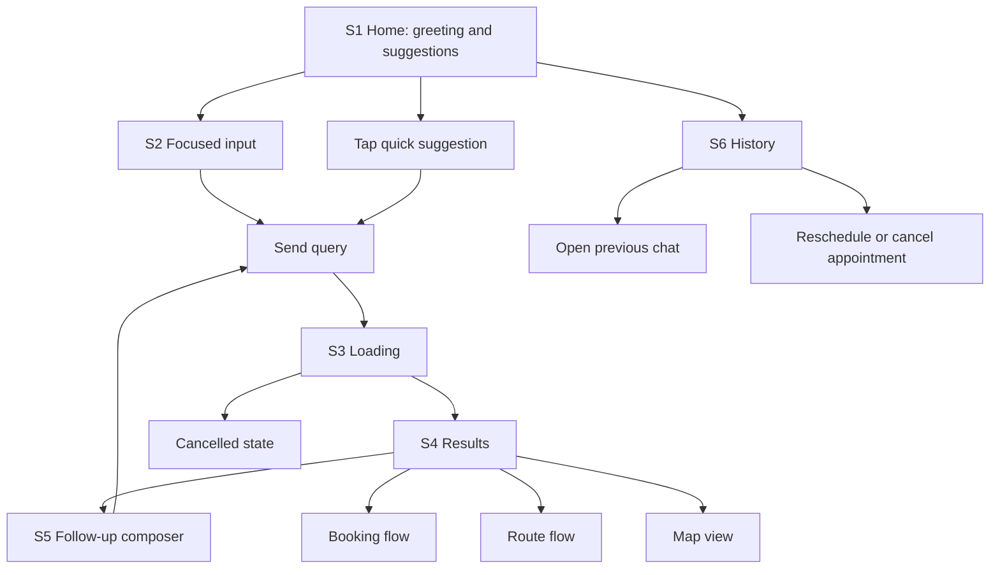

# UI component specification: ИИ-помощник

> Табличное описание мобильного интерфейса по предоставленным скриншотам.  
> Цель документа: разложить UI на продуктовые компоненты, указать где каждый компонент виден на скринах, зачем он нужен, из чего состоит и как должен себя вести.

## 1. Контекст продукта

Интерфейс выглядит как мобильный bottom-sheet помощник внутри городского или lifestyle-приложения. Пользователь может спросить ассистента о местах, планах, услугах и записях; ассистент ищет варианты, показывает карточки результатов, позволяет построить маршрут, открыть место на карте, записаться и вернуться к истории.

Ключевые сценарии:

| Сценарий | Пользовательская задача | Что показывает UI |
|---|---|---|
| Старт диалога | Быстро понять, что можно спросить | Приветствие, подсказки, поле ввода |
| Ручной ввод | Написать свой запрос | Активный composer и клавиатура |
| Поиск | Понять, что ассистент работает | Bubble пользователя, статус поиска, stop button |
| Результаты | Выбрать место или услугу | Карточки мест с фото, рейтингом, описанием и CTA |
| Follow-up | Задать уточняющий вопрос | Sticky/floating composer поверх результатов |
| История | Вернуться к чатам и записям | Секции `Записи` и `Чаты` |

## 2. Индекс скриншотов

| ID | Экран | Где используется в документе | Ключевые элементы |
|---|---|---|---|
| `S1` | Home / empty assistant state | Стартовый экран | Header, greeting, suggestions, idle composer |
| `S2` | Focused input state | Ввод текста | Focused composer, send button, keyboard |
| `S3` | Loading / assistant thinking state | Поиск ответа | User bubble, assistant status, stop button |
| `S4` | Results state | Полная лента результатов | Result cards, image strips, CTA, feedback bar |
| `S5` | Results with floating composer | Результаты со скроллом | Compact floating composer поверх карточки |
| `S6` | History state | История | Appointment carousel, chat history, FAB |

## 3. Визуальный язык

| Токен / роль | Где видно | Описание |
|---|---|---|
| `sheet/background` | `S1-S5`, вся поверхность | Белая поверхность ассистента, ощущение легкого модального слоя |
| `history/background` | `S6`, фон экрана истории | Светло-серый фон, отделяет историю от диалогового режима |
| `surface/muted` | `S1`, suggestions и composer; `S6`, icon buttons | Светло-серые контролы с мягким радиусом |
| `surface/card` | `S6`, appointment и chat cards | Белые карточки на сером фоне |
| `accent/green` | `S2`, send button; `S6`, FAB и `Перенести` | Основной позитивный/action цвет |
| `accent/lavender` | `S3-S5`, user bubble; `S4`, `Записаться` | Мягкий secondary accent для пользовательских сообщений и primary CTA |
| `accent/red` | `S6`, `Отменить` | Негативное действие |
| `accent/rating` | `S4-S5`, rating stars | Желтые звезды рейтинга |
| `brand/sparkle` | `S1-S5`, центр header; `S3`, assistant status | Цветная sparkle-иконка как брендовый маркер ассистента |
| `text/primary` | Все экраны | Основные заголовки и действия |
| `text/secondary` | `S4`, категории и метаданные; `S6`, адреса и подписи | Дополнительная информация |
| `text/placeholder` | `S1`, `S5`, composer | Подсказки в полях ввода |

## 4. Карта экранов

| Экран | Screen ref | Назначение | Основные компоненты | Состояние пользователя |
|---|---|---|---|---|
| Home / empty state | `S1` | Первый контакт с ассистентом | `AssistantSheet`, `SheetHeader`, `GreetingBlock`, `SuggestionsWidget`, `ChatComposer` | Пользователь еще не начал диалог |
| Focused input | `S2` | Ручной ввод запроса | `GreetingBlock`, `ChatComposer`, `SendButton`, `SystemKeyboardOverlay` | Пользователь готов отправить текст |
| Loading | `S3` | Ассистент ищет ответ | `UserMessageBubble`, `AssistantLoadingState`, `StopGeneratingButton` | Пользователь ожидает результат |
| Results | `S4` | Показ найденных мест | `CompanyCardWidget`, `ActionButtonsWidget`, `SourcesFeedbackWidget` | Пользователь выбирает место или действие |
| Results + floating composer | `S5` | Follow-up во время просмотра результатов | `ComposerFloatingCompact`, `CompanyCardWidget` | Пользователь скроллит и может уточнить запрос |
| History | `S6` | Возврат к записям и чатам | `HistoryScreen`, `AppointmentCarousel`, `ChatHistorySection`, `NewChatFab` | Пользователь управляет прошлым и будущим контекстом |

## 5. Виджеты

Виджет — это готовый продуктовый блок, который готовится и переиспользуется как единое целое. Внутренние элементы виджета описаны для аналитики и дизайна, но в экранной композиции виджет считается одним компонентом.

| Виджет | Screen ref / где смотреть | Включает элементы | Назначение | Состояния / поведение | UX notes |
|---|---|---|---|---|---|
| `SuggestionsWidget` | `S1`, серый блок с быстрыми запросами над нижним composer | `SuggestionList`, `SuggestionRow`, `SuggestionIcon` | Дать пользователю быстрый старт без ручного ввода | Tap по строке отправляет запрос или подставляет его в composer; после отправки экран переходит в `LoadingState` | Виджет должен готовиться как единый набор подсказок под контекст пользователя и города |
| `CompanyCardWidget` | `S4`, карточки `Chop Chop` и `Mad House`; `S5`, карточка под floating composer | `PlaceResultCard`, `ImageStrip`, `PlaceTitle`, `PlaceCategory`, `RatingRow`, `StarsRating`, `MetaRow`, `DescriptionBlock` | Показать найденную компанию/место и дать достаточно данных для выбора | Tap по карточке может открыть детали; image strip может открывать галерею; текст может сворачиваться при длинном описании | Это основной виджет выдачи. Важно валидировать соответствие запроса, категории, фото и описания |
| `SourceWidget` | `S4`, inline-метки `vk.com`, `2gis.ru +1` внутри описания карточки | `InlineSourceChip` | Показать, откуда взяты факты в описании компании | Tap по source chip открывает источник или список источников | Источники лучше визуально отделять от основного текста, чтобы не ломать чтение описания |
| `ActionButtonsWidget` | `S4`, ряд кнопок `Записаться`, `Маршрут`, `На карте` под описанием | `PlaceActionBar`, `BookButton`, `RouteButton`, `MapButton` | Дать быстрые действия по выбранной компании | `Записаться` → booking flow; `Маршрут` → route; `На карте` → map | Виджет должен быть conditional: не показывать `Записаться`, если запись недоступна |
| `SourcesFeedbackWidget` | `S4`, нижняя часть ответа: `4 источника`, copy, like, dislike | `SourcesFeedbackBar` | Показать доверие к ответу и собрать feedback | Sources → список источников; copy → копировать ответ; like/dislike → feedback | Feedback должен сохраняться на уровне ответа, а не конкретной карточки |

## 6. Layout и навигация

| Компонент | Screen ref / где смотреть | Назначение | Состав | Состояния / поведение | UX notes |
|---|---|---|---|---|---|
| `AssistantSheet` | `S1-S6`, весь белый или серый bottom-sheet; верхние углы экрана | Основной контейнер ассистента поверх базового приложения | Surface, rounded top corners, safe area, scroll area, bottom area | `home`, `inputFocused`, `loading`, `results`, `history`; закрывается через `CloseButton`; содержит внутренний scroll | Хорошо считывается как модальный слой, а не отдельный экран приложения |
| `DragHandle` | `S1-S6`, тонкая серая полоска сверху по центру | Показывает, что sheet можно потянуть или свернуть | Маленький горизонтальный индикатор | Passive affordance; может участвовать в swipe gesture | Нужен consistent hit/gesture area, даже если визуально handle маленький |
| `SheetHeader` | `S1-S5`, верхняя строка с `ИИ-помощник`; `S6`, строка с `История` | Навигационная шапка текущего режима | Left icon button, centered title/brand, right close button | Вариант `assistant`; вариант `history` | Заголовок должен оставаться визуально центрированным независимо от ширины боковых кнопок |
| `BrandTitle` | `S1-S5`, центр header | Брендинг ассистента | Sparkle icon + `ИИ-помощник` | Static; может быть кликабельным для возврата на home | Sparkle визуально связывает бренд с assistant loading state |
| `HistoryButton` | `S1-S5`, слева в header | Открыть историю | Иконка часов/истории в сером квадрате | Tap → `HistoryScreen` | Иконка похожа на history/recents, достаточно понятна |
| `BackButton` | `S6`, слева в header | Вернуться из истории в ассистента | Chevron/back icon в сером квадрате | Tap → предыдущий assistant state | Отличается от `HistoryButton`, что помогает не путать режимы |
| `CloseButton` | `S1-S6`, справа в header | Закрыть assistant sheet | X icon в сером квадрате | Tap → закрыть модальный слой | Hit area должен быть не меньше 44x44 px |
| `IconButton` | `S1-S6`, все квадратные иконки | Универсальный паттерн иконочной кнопки | Icon, muted surface, radius | `default`, `pressed`, `disabled`, `active` | Визуальная иконка может быть меньше, но tap target должен оставаться крупным |

## 7. Home / стартовый экран

| Компонент | Screen ref / где смотреть | Назначение | Состав | Состояния / поведение | UX notes |
|---|---|---|---|---|---|
| `GreetingBlock` | `S1`, нижняя половина экрана; `S2`, над composer | Персонально встречает пользователя и задает тон | `Привет, Илья!` + `Чем могу помочь?` | Static; имя берется из профиля | Большое пустое пространство сверху делает экран спокойным и premium |
| `GreetingNameAccent` | `S1-S2`, слово `Илья!` в первой строке | Персонализация и эмоциональный акцент | Имя пользователя с зелено-голубым gradient/accent | Fallback: `Привет!`, если имени нет | Акцент не должен конкурировать с CTA |
| `SuggestionsWidget` | `S1`, серый блок над нижним composer | Готовый виджет быстрых запросов | `SuggestionList` + `SuggestionRow` + `SuggestionIcon` | Tap по строке отправляет или подставляет запрос | Сейчас подсказки покрывают городские прогулки; можно добавить сценарий записи |

## 8. Ввод и composer

| Компонент | Screen ref / где смотреть | Назначение | Состав | Состояния / поведение | UX notes |
|---|---|---|---|---|---|
| `ChatComposer` | `S1`, внизу; `S2`, над клавиатурой; `S4`, внизу; `S5`, поверх карточки | Основной ввод текста и голоса | Text input, optional mode button, voice button, send button | `idle`, `focused`, `sticky`, `floatingCompact`, `disabledLoading` | Один компонент должен адаптироваться к разным режимам, а не быть разными UI |
| `ComposerIdle` | `S1`, нижняя панель | Начальное состояние ввода | Placeholder `ИИ-помощник`, mode button, mic button | Tap по полю → `focused`; mic → voice input | Placeholder связан с брендом, но не объясняет, что можно спросить |
| `ComposerFocused` | `S2`, над клавиатурой | Активный текстовый ввод | Text field с caret, зеленый send button | Текст не пустой или focus active; send → отправка запроса | Send button хорошо выделен зеленым и визуально заменяет голосовые действия |
| `ComposerSticky` | `S4`, нижняя зона результатов | Follow-up после ответа | Input `Спросите про город`, mic icon | Sticky bottom; сохраняет доступ к уточнению | Нужно дать bottom padding списку, чтобы composer не перекрывал feedback bar |
| `ComposerFloatingCompact` | `S5`, поверх карточки `Mad House`, в нижней части экрана | Быстрый follow-up во время скролла | Floating input + mic icon + shadow | Появляется при скролле или compact state | Удобно, но перекрывает часть карточки; важно не закрывать CTA |
| `TextInput` | `S1-S2`, поле ввода; `S5`, floating input | Ввод пользовательского запроса | Rounded input, placeholder, caret | `empty`, `focused`, `typing`, `disabled` | Минимальный визуальный шум; placeholder должен быть контекстным |
| `SendButton` | `S2`, зеленая кнопка справа от поля | Отправка текста | Зеленая квадратная кнопка со стрелкой | Enabled при вводе или focused state; tap → send | Цвет делает action очевидным |
| `VoiceButton` | `S1`, справа; `S5`, внутри floating composer | Голосовой ввод | Mic icon | Tap → voice capture | На `S1` рядом есть второй mode button, роли могут путаться |
| `ModeButton` | `S1`, кнопка с vertical bars рядом с mic | Дополнительный режим ввода | Иконка audio/equalizer | Функция по скрину не очевидна | Нужен tooltip/onboarding или более понятная иконка |
| `SystemKeyboardOverlay` | `S2`, нижняя половина экрана | Системная клавиатура, влияющая на layout | Keyboard surface, keys, system controls | Открывается при focus, закрывается при blur/send | Composer должен всегда оставаться над клавиатурой |

## 9. Диалог и loading state

| Компонент | Screen ref / где смотреть | Назначение | Состав | Состояния / поведение | UX notes |
|---|---|---|---|---|---|
| `ChatThread` | `S3`, верхняя часть экрана с user bubble и assistant status; `S4-S5`, контент ответа | Контейнер сообщений диалога | User messages, assistant states, result blocks | Новые сообщения идут сверху вниз; user справа, assistant слева/на всю ширину | Нужен auto-scroll к последнему активному состоянию |
| `UserMessageBubble` | `S3-S5`, голубой bubble справа с текстом `Какие еще барбершопы есть` | Отображает запрос пользователя | Текст, light-blue background, rounded corners | Static после отправки; может участвовать в long press/copy | Max-width около 65-75% экрана |
| `AssistantLoadingState` | `S3`, строка `Ищу барбершопы рядом` под user bubble | Показывает, что ассистент выполняет поиск | Sparkle icon + текст статуса | `searching`, `thinking`, `fetching`; исчезает после результата | Текст статуса хороший: объясняет не просто “думаю”, а конкретное действие |
| `AssistantStatusIcon` | `S3`, sparkle слева от статуса | Брендовый маркер ассистента | Цветная sparkle-иконка | Может анимироваться | Анимация должна уважать `prefers-reduced-motion` |
| `AssistantStatusText` | `S3`, `Ищу барбершопы рядом` | Объясняет текущий шаг | Короткая фраза в сером тексте | Обновляется по этапам поиска | Лучше использовать глагол действия: ищу, проверяю, подбираю |
| `StopGeneratingButton` | `S3`, маленькая кнопка снизу по центру | Остановка поиска/генерации | Светлая floating-кнопка, квадрат stop icon | Tap → cancel; затем показать composer или partial state | Кнопка минимальная, но может быть слишком незаметной |

## 10. Результаты поиска

| Компонент | Screen ref / где смотреть | Назначение | Состав | Состояния / поведение | UX notes |
|---|---|---|---|---|---|
| `AssistantResultList` | `S4`, вертикальная лента карточек; `S5`, скролл результатов | Контейнер выдачи ассистента | Несколько `CompanyCardWidget`, `ActionButtonsWidget`, `SourcesFeedbackWidget`, composer | Вертикальный scroll; follow-up сохраняет контекст | Должен иметь bottom padding под composer |
| `CompanyCardWidget` | `S4`, блок `Chop Chop`; ниже `Mad House`; `S5`, карточка в скролле | Готовый виджет карточки компании | `PlaceResultCard`, `ImageStrip`, `PlaceTitle`, `PlaceCategory`, `RatingRow`, `StarsRating`, `MetaRow`, `DescriptionBlock` | Tap по карточке → детали; image strip → gallery; описание может сворачиваться | Основной виджет выдачи; должен собираться из консистентных данных одной компании |
| `SourceWidget` | `S4`, маленькие `vk.com`, `2gis.ru +1` внутри описания | Готовый виджет источника | `InlineSourceChip` | Tap → источник или список источников | Лучше отделить источники от текста, чтобы не ломать чтение |
| `ActionButtonsWidget` | `S4`, кнопки `Записаться`, `Маршрут`, `На карте` под описанием | Готовый виджет действий по компании | `PlaceActionBar`, `BookButton`, `RouteButton`, `MapButton` | `Записаться` → booking; `Маршрут` → route; `На карте` → map | Должен адаптироваться под доступные действия компании |
| `SourcesFeedbackWidget` | `S4`, нижняя часть результатов: `4 источника`, copy, like, dislike | Готовый виджет доверия и обратной связи по ответу | `SourcesFeedbackBar` | Sources → source list; copy → copy answer; like/dislike → feedback | Важно сохранять feedback на уровне ответа, а не отдельной карточки |

## 11. История и записи

| Компонент | Screen ref / где смотреть | Назначение | Состав | Состояния / поведение | UX notes |
|---|---|---|---|---|---|
| `HistoryScreen` | `S6`, весь экран истории | Возврат к прошлым чатам и будущим записям | Header, `Записи`, carousel, `Чаты`, FAB | Scroll; back возвращает в assistant | Серый фон хорошо отделяет историю от диалога |
| `SectionHeader` | `S6`, крупные заголовки `Записи` и `Чаты` | Разделяет типы сущностей | Large bold title | Static | Заголовки помогают быстро понять структуру экрана |
| `AppointmentCarousel` | `S6`, горизонтальные карточки под `Записи`; справа видна следующая карточка | Показывает ближайшие и следующие записи | Несколько `AppointmentCard`, horizontal overflow | Horizontal scroll; первая карточка — ближайшая | Peek следующей карточки хорошо показывает, что есть скролл |
| `AppointmentCard` | `S6`, белая карточка `Стрижка головы (барбер)` | Детали будущей записи | Label, service title, place, address, specialist, date/time, actions | Tap → детали; actions → reschedule/cancel | Карточка уже похожа на мини-чеклист записи |
| `AppointmentLabel` | `S6`, `Ближайшая запись` | Обозначает приоритет записи | Small muted label | Меняется: ближайшая, следующая, прошедшая | Полезно для сортировки без лишнего текста |
| `AppointmentInfoRow` | `S6`, строки с иконками: место, специалист, дата | Структурирует детали записи | Icon + primary text + secondary text | Static; row может быть clickable | Иконки слева делают карточку сканируемой |
| `RescheduleButton` | `S6`, зеленое действие `Перенести` | Изменить дату/время записи | Icon + label на светлом фоне | Tap → reschedule flow | Зеленый здесь означает позитивное действие, не primary submit |
| `CancelAppointmentButton` | `S6`, красное действие `Отменить` | Отменить запись | X icon + label | Tap → confirmation dialog | Нужен confirm, потому что действие разрушительное |
| `ChatHistorySection` | `S6`, блок `Чаты` с группами `Сегодня`, `Вчера` | Список прошлых диалогов | Group labels, chat history cards, rows | Scroll; tap row → открыть чат | История объединяет поиск, вопросы и записи в один assistant hub |
| `GroupLabel` | `S6`, `Сегодня`, `Вчера` | Временная группировка истории | Muted text label | Static | Нужна для ориентации в длинной истории |
| `ChatHistoryCard` | `S6`, белый контейнер строк истории | Группа чат-строк внутри даты | Rounded card, separators, rows | Может содержать 1+ item | Белая карточка на сером фоне хорошо держит структуру |
| `ChatHistoryItemSearch` | `S6`, строка `Самые красивые кофейни` с search icon | История поискового запроса | Search icon + title | Tap → открыть чат/результат | Иконка показывает тип intent |
| `ChatHistoryItemQuestion` | `S6`, строка `Есть ли детское меню?` + `Сыроварня` | История вопроса по конкретному месту | Question icon, title, subtitle | Tap → открыть чат в контексте места | Subtitle важен: без него вопрос слишком общий |
| `ChatHistoryItemBooking` | `S6`, строка `Запиши меня на стрижку` с calendar icon | История записи/booking intent | Calendar icon + title | Tap → открыть booking-related chat | Иконка календаря связывает чат с записью |
| `NewChatFab` | `S6`, зеленая floating-кнопка справа снизу | Начать новый чат из истории | Chat bubble + plus | Tap → новый пустой чат/home | Хороший быстрый выход из режима истории |

## 12. Состояния и edge cases

| State / компонент | Где должен появляться | Когда возникает | Что показать | UX требование |
|---|---|---|---|---|
| `EmptyHomeState` | `S1` | Пользователь открыл ассистента впервые или без активного чата | Greeting + `SuggestionsWidget` + idle composer | Не перегружать onboarding-текстом |
| `InputFocusedState` | `S2` | Пользователь тапнул в поле ввода | Focused composer + keyboard | Не скрывать контекст полностью; сохранить greeting |
| `LoadingState` | `S3` | Запрос отправлен, результат еще не готов | User bubble + assistant status + stop button | Статус должен объяснять текущий шаг |
| `NoResultsState` | Не показан на скринах | Источники не нашли подходящих мест | Мягкое сообщение, новый `SuggestionsWidget`, изменить локацию/категорию | Не оставлять пользователя в тупике |
| `LocationPermissionMissing` | Не показан на скринах | Нужна геолокация для `рядом`, но доступа нет | Объяснение + кнопка включить геолокацию + ручной ввод района | Особенно важно для запросов `рядом` |
| `SourceErrorState` | Не показан на скринах | Ошибка 2GIS/VK/других источников | Partial result или retry | Не выдавать неподтвержденные карточки как уверенный результат |
| `CancelledState` | После `StopGeneratingButton` | Пользователь остановил поиск | Composer + текст `Поиск остановлен` + возможно partial results | Дать быстрый путь продолжить |
| `BookingUnavailableState` | Внутри `ActionButtonsWidget` | У места нет онлайн-записи | Скрыть `Записаться` или заменить на `Позвонить`/`Сайт` | CTA должен соответствовать возможностям места |

## 13. Черновая модель данных

| Entity | Поля | Используется в UI |
|---|---|---|
| `Place` | `id`, `title`, `category`, `images`, `rating`, `reviewCount`, `travelTimeMinutes`, `priceFacts`, `description`, `sources`, `actions` | `CompanyCardWidget`, `ActionButtonsWidget` |
| `Source` | `id`, `domain`, `url`, `title`, `confidence`, `usedFacts` | `SourceWidget`, `SourcesFeedbackWidget`, source details |
| `PlaceAction` | `type`, `label`, `icon`, `enabled`, `target` | `ActionButtonsWidget` |
| `Appointment` | `id`, `label`, `serviceTitle`, `placeName`, `address`, `specialistName`, `specialistRole`, `dateLabel`, `timeLabel`, `status` | `AppointmentCard`, `AppointmentCarousel` |
| `ChatHistoryEntry` | `id`, `title`, `subtitle`, `kind`, `dateGroup`, `lastOpenedAt` | `ChatHistorySection`, `ChatHistoryItem*` |
| `AssistantMessage` | `id`, `role`, `text`, `status`, `resultBlocks`, `createdAt` | `ChatThread`, `UserMessageBubble`, `AssistantLoadingState`, results |

## 14. Interaction flow

## 15. Product / UX observations

| Observation | Где видно | Почему важно | Рекомендация |
|---|---|---|---|
| Bottom-sheet паттерн считывается хорошо | `S1-S6` | Помощник ощущается как быстрый слой поверх приложения | Сохранить consistent header и rounded sheet |
| Home выглядит чисто и premium | `S1` | Много воздуха снижает когнитивную нагрузку | Не перегружать стартовый экран баннерами |
| Подсказки слишком узко про прогулки | `S1` | История показывает, что продукт также про записи и вопросы по местам | Добавить 1 подсказку про запись или услугу |
| В результатах есть semantic mismatch | `S4-S5` | Запрос про барбершопы, категория `Косметический кабинет`, описание про кофейню | Перед показом карточки валидировать соответствие query → category → description |
| Карточки результатов перегружены текстом | `S4-S5` | На мобильном первый экран почти полностью занимает одна карточка | Сократить описание до 2-3 bullets или добавить expand |
| Floating composer удобен, но перекрывает контент | `S5` | Может закрывать рейтинг, метаданные или CTA | Добавить safe bottom padding и правила появления |
| История объединяет чаты и записи | `S6` | Помощник становится персональным городским hub | Развивать history как ключевой retention screen |

## 16. Приоритетные улучшения

| Priority | Улучшение | Компоненты | Почему |
|---|---|---|---|
| P0 | Исправить consistency результатов: категория, фото, описание и CTA должны относиться к одной сущности | `CompanyCardWidget`, `ActionButtonsWidget` | Это главный риск доверия к ассистенту |
| P1 | Добавить явные empty/error states | `AssistantResultList`, `ChatThread`, `ChatComposer` | Сейчас не описано, что происходит при ошибке или отсутствии мест |
| P1 | Сократить описание карточки | `CompanyCardWidget`, `SourceWidget` | Улучшит сканирование результатов на мобильном |
| P2 | Уточнить роль `ModeButton` | `ChatComposer`, `ModeButton` | Сейчас иконка не объясняет действие |
| P2 | Добавить контекст локации | `AssistantLoadingState`, `CompanyCardWidget` | Пользователь должен понимать, где именно идет поиск |
