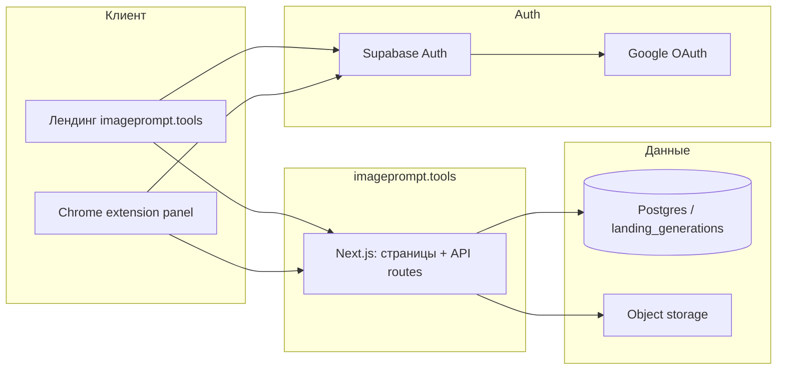

# Требования: отдельный домен imageprompt.tools для лендинга STV, авторизации и генераций

> **Дата:** 2026-03-30  
> **Статус:** требования (к реализации)  
> **Связанные документы:** архитектура лендинга — в монорепо aiphoto: `docs/architecture/01-landing.md`; [extension-ui-spec.md](../extension-ui-spec.md), [22-03-stv-single-generation-flow.md](../22-03-stv-single-generation-flow.md), [30-03-variant-a-landing-extension-new-repo.md](./30-03-variant-a-landing-extension-new-repo.md). **Репозиторий:** [github.com/azarovmaxim/imageprompt](https://github.com/azarovmaxim/imageprompt).

---

## 1. Продукт и задача

**Продукт:** маркетинговый лендинг Chrome-инструмента «Image to prompt» / Steal This Vibe (`/extension-stv`, embed панели), backend — Next.js API лендинга + Supabase (`landing_generations` и др.).

**Проблема сейчас:** лендинг и «мои генерации» привязаны к каноническому домену PromptShot (`promptshot.ru`); сессия и ссылки ведут на тот же origin.

**Цель:** вынести **продуктовый контур** на собственный домен **`https://imageprompt.tools`**: лендинг, вход пользователя и страница истории генераций — **без опоры на `promptshot.ru`** в пользовательских URL и cookie (кроме явно согласованных исключений).

**Стратегия кода (зафиксировано):** **вариант A** — отдельный git-репозиторий с **полными** каталогами **`landing/`** и **`extension/`** без вырезания остального Next-приложения внутри `landing/`. Пошаговый план: [30-03-variant-a-landing-extension-new-repo.md](./30-03-variant-a-landing-extension-new-repo.md).

---

## 2. Термины

| Термин | Значение |
|--------|----------|
| **Новый домен** | `imageprompt.tools` (прод: `https://imageprompt.tools`) |
| **Старый домен** | `https://promptshot.ru` (текущий канонический лендинг) |
| **«Без редиректа на PromptShot»** | После входа пользователь не оказывается на `promptshot.ru` для продолжения сценария. Редиректы на **Google OAuth** допустимы (ограничение протокола). |

---

## 3. Функциональные требования

### 3.1 Лендинг на своём домене

| ID | Требование |
|----|------------|
| F1 | Маркетинговые маршруты (`/extension-stv`, `/extension-stv/pricing` и согласованные подстраницы) доступны на **`https://imageprompt.tools`** с корректным TLS. |
| F2 | Канонические URL в metadata (canonical, Open Graph), `NEXT_PUBLIC_SITE_URL` и аналогичные публичные ссылки — **только новый домен** для этого продукта. |
| F3 | Встраиваемая веб-панель (если используется на лендинге, например `/embed/stv`) обслуживается с **того же origin** `imageprompt.tools`, чтобы cookie сессии и API были same-site с лендингом. |

### 3.2 Авторизация на новом домене и кнопка «Войти»

| ID | Требование |
|----|------------|
| F4 | **Supabase Auth:** Site URL и Redirect URLs включают **`https://imageprompt.tools`** и callback(и) приложения на этом домене (например `/auth/callback` с поддержкой `next=`). |
| F5 | Обмен кода OAuth → сессия завершается на **origin нового домена**; сессионные cookie выдаются для **`imageprompt.tools`** (first-party), не для `promptshot.ru`. |
| F6 | В **шапке маркетингового лендинга** (компонент уровня `ExtensionStvMarketingHeader` и согласованные страницы) отображается кнопка **«Войти»** для неавторизованного пользователя и состояние аккаунта / выход для авторизованного (поведение согласовать с существующим `AuthProvider` / `AuthModal`). |
| F7 | Поток входа **не отправляет** пользователя на `promptshot.ru` для завершения сессии (только провайдер OAuth и возврат на `imageprompt.tools`). |

### 3.3 Генерации на новом домене

| ID | Требование |
|----|------------|
| F8 | Публичная страница **«Мои генерации»** доступна по **`https://imageprompt.tools/generations`** (и детальные маршруты, если есть — с того же origin). |
| F9 | API списка/деталей генераций (`/api/generations`, `/api/generations/[id]` и связанные write-path) вызываются с **origin нового домена**; ссылки из UI расширения и лендинга ведут на **`imageprompt.tools`**, а не на `https://promptshot.ru/generations`. |
| F10 | Данные по-прежнему привязаны к `user.id` Supabase; **источник правды** по схеме — согласовать: один проект Supabase на оба домена (предпочтительно для непрерывности аккаунта) или отдельный проект (тогда нужна миграция/политика данных — отдельное решение). |

### 3.4 Расширение Chrome

| ID | Требование |
|----|------------|
| F11 | `getApiOrigin()` / сборка STV и **manifest** (`host_permissions`, при необходимости `oauth2` / страница callback) указывают на **`https://imageprompt.tools`** в прод-сборке (конфигурация через env на этапе сборки допустима). |
| F12 | После смены домена выпущена новая версия расширения в Chrome Web Store с обновлёнными разрешениями. |

---

## 4. Нефункциональные требования

### 4.1 Доступность и производительность

| ID | Требование |
|----|------------|
| N1 | Доступность прод-контура нового домена — не хуже текущего лендинга (зафиксировать целевой SLO, напр. monthly uptime ≥ 99.5%). |
| N2 | Список генераций: пагинация, индексы БД по `user_id` + времени; без выгрузки всей истории одним ответом при росте объёма. |
| N3 | LCP главной маркетинговой страницы — в рамках бюджета команды; статика — с возможностью кеша на CDN/edge. |

### 4.2 Безопасность

| ID | Требование |
|----|------------|
| N4 | В консоли Supabase перечислены только доверенные URL редиректа; prod не содержит лишних callback на неиспользуемые домены. |
| N5 | Cookies: `Secure`, корректный `SameSite` для сценария **веб + extension**; CORS / допустимые origins для `chrome-extension://` согласованы с текущей моделью API. |
| N6 | Секреты только из env; без хардкода ключей и прод-URL в репозитории. |

### 4.3 Наблюдаемость

| ID | Требование |
|----|------------|
| N7 | Мониторинг 5xx на `/api/*`, ошибок OAuth callback, p95 латентности критичных маршрутов (`/api/me`, `/api/generations`). |
| N8 | Сохранить корреляцию запросов (например заголовок трассировки STV-pipeline), чтобы диагностировать цепочку upload → generate. |

---

## 5. Целевая архитектура (кратко)

**Граница:** домен меняет **origin, DNS, cookie и ссылки**; БД и бизнес-логика API — по решению из F10 (один или два проекта Supabase).

---

## 6. Масштабирование и узкие места

- Первыми упираются: **API генераций**, загрузка медиа, лимиты внешнего image-provider, частота polling статуса из панели.
- Лендинг — преимущественно статика/лёгкий SSR; кеш на edge для анонимных страниц.

---

## 7. Эволюция и миграция (без big bang)

1. Staging на поддомене или отдельном окружении с тем же кодом и `NEXT_PUBLIC_SITE_URL=https://imageprompt.tools` (или preview-URL).
2. Проверка полного сценария: вход → генерация → список на `/generations`.
3. Обновление расширения и публикация в Store.
4. DNS прод для `imageprompt.tools`.
5. Опционально: **301** с `https://promptshot.ru/extension-stv*` на новые URL; на старом сайте — краткое указание нового домена (если продукт разделяется по бренду).

---

## 8. Открытые решения (зафиксировать до разработки)

- [ ] **Один Supabase-проект** для `promptshot.ru` и `imageprompt.tools` vs **отдельный проект** только под новый домен.
- [ ] Нужен ли **параллельный** хостинг дубля страниц на `promptshot.ru` на переходный период.
- [ ] Точный UX входа: только модалка, отдельная страница `/login`, или popup OAuth (все варианты с возвратом на `imageprompt.tools`).

---

## 9. Чеклист реализации

_По [docs-workflow.mdc](../../.cursor/rules/docs-workflow.mdc): после релиза отметить пункты и при необходимости перенести документ в `docs/done/`._

- [ ] Новый репозиторий: импорт `landing/` + `extension/` по [30-03-variant-a-landing-extension-new-repo.md](./30-03-variant-a-landing-extension-new-repo.md)
- [ ] DNS + TLS для `imageprompt.tools`
- [ ] Деплой Next (тот же образ/пайплайн или отдельный сервис) с env нового домена
- [ ] Supabase: Site URL, Redirect URLs, при необходимости Google Cloud OAuth redirect URIs
- [x] Код: `NEXT_PUBLIC_SITE_URL`, fallback продакшена — `https://imageprompt.tools` для контура STV (см. репозиторий imageprompt)
- [ ] Шапка лендинга STV: «Войти» / аккаунт
- [ ] Расширение: API origin, manifest permissions, auth callback
- [ ] Регрессия: embed, покупка кредитов (если есть deep link), `/generations`
- [ ] Обновить [architecture/01-landing.md](../architecture/01-landing.md) (дата и раздел про домены/маршруты)

---

## 10. Связь с кодом (ориентиры)

| Область | Файлы / места |
|---------|----------------|
| Канонический URL лендинга STV | `landing/src/app/extension-stv/page.tsx`, `pricing/page.tsx` |
| Шапка маркетинга | `landing/src/components/extension-stv/ExtensionStvMarketingHeader.tsx` |
| Auth | `landing/src/context/AuthContext.tsx`, `landing/src/app/auth/callback/route.ts`, `landing/src/components/AuthModal.tsx` |
| Генерации API | `landing/src/app/api/generations/route.ts`, `[id]/route.ts` |
| Панель STV | `extension/sidepanel/stv-core.js`, `stv-config.js`, `landing/public/stv-panel/boot.mjs` |
